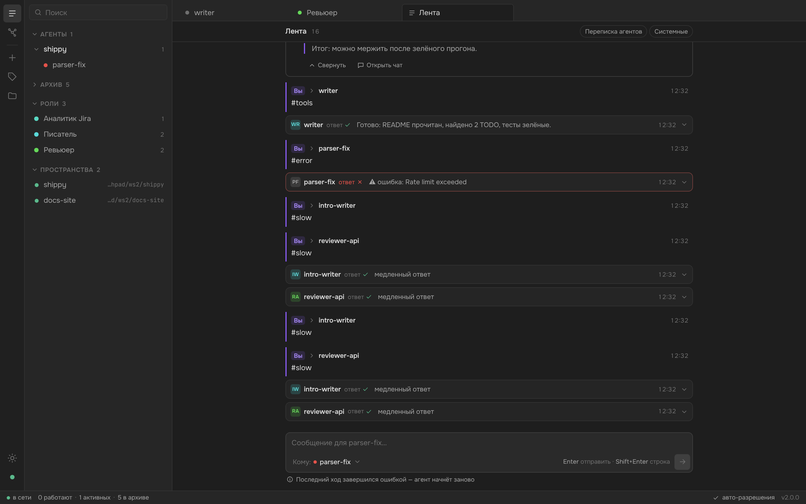
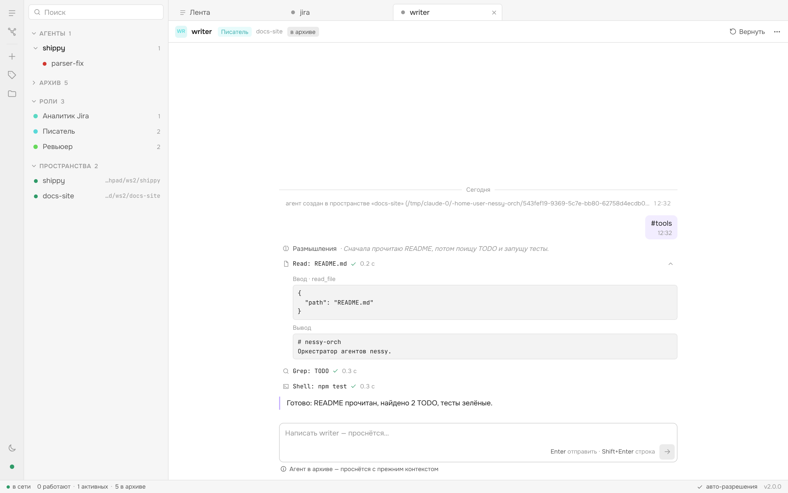
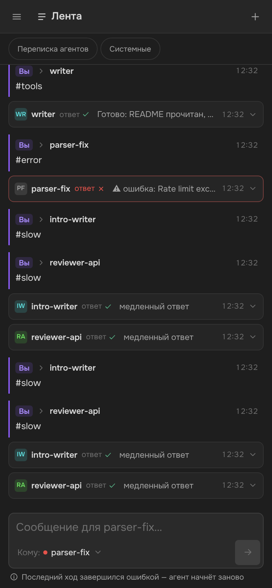

# nessy-orch

Оркестратор агентов **nessy**. Главная нода («Вы» — человек и Claude Code) запускает независимых агентов nessy
в рабочих пространствах, пишет им и получает ответы. Агенты могут писать друг другу. Вся переписка видна в одной
общей ленте, состояние — в живом графе.

Зачем: у nessy есть доступ к dp-инструментам (GitLab, Jira, Sage, Wiki) и долгая автономная работа в воркспейсе,
которых нет у Claude в песочнице. nessy-orch даёт простой способ делегировать nessy задачи и следить за ними.



<p>
  
  
</p>

## Возможности

- **Пространства (spaces).** Пространство = каталог-воркспейс + процесс `nessy serve`, который запускает оркестратор
  (managed), либо уже запущенный демон по URL (external). Порты выделяются автоматически.
- **Агенты.** Каждый агент — независимая сессия nessy (`sessionScope: thread`). Статусы простые: `starting`,
  `working`, `idle`, `error`. У агента есть очередь сообщений: сообщения агентов друг другу ждут своей очереди,
  а ваше сообщение работающему агенту прерывает текущий ход и доставляется первым (`send --queue` — в очередь).
  Очередь переживает рестарт.
- **Архив.** Агент, успешно закончивший задачу, уходит в архив: он скрыт из рабочего списка, но сессия и контекст
  сохранены. Любое сообщение будит его, поэтому к агенту по имени можно вернуться в любой момент. Ход с ошибкой
  оставляет агента на виду; упавшая сессия пересоздаётся при следующем сообщении.
- **Роли.** Сохранённые инструкции (`role add`), которые попадают во вводную агента: `spawn --role reviewer`.
- **Произвольный граф общения.** `Вы ↔ агент`, `агент ↔ агент`. Ответ агента автоматически уходит отправителю.
  Агенты пишут другим сами, через shell: `nessy-orch send --from <id> <кому> "текст"`.
- **Защиты.** Лимит длины цепочки (8 переходов), лимит сообщений на пару (30 в минуту), обнаружение взаимного
  ожидания (`409 deadlock`), проверка `Host`/`Origin` (защита от DNS-rebinding и CSRF из браузера).
- **Права.** По умолчанию запросы прав подтверждаются автоматически (с записью в журнал агента). При
  `ORCH_AUTO_APPROVE=0` запросы ждут решения в UI или через API.
- **Устойчивость.** Падение `nessy serve` или рестарт оркестратора — сессия агента восстанавливается при следующем
  обращении. Состояние и роли пишутся атомарно в `~/.nessy-orch/`.
- **Веб-интерфейс** в стиле Obsidian: дерево агентов и ролей, вкладки, компактная лента, чат с каждым агентом, граф. Работает на десктопе, планшете и телефоне.
- **CLI** — единый бинарь `nessy-orch`: предсказуемый вывод, `--json`, блокирующий (`--wait`) и фоновый режимы.

## Быстрый старт

Нужен Node.js ≥ 20 и установленный `nessy` (по умолчанию `~/.local/bin/nessy`).

```sh
cd ~/Projects/nessy-orch
npm install
npm run build                       # сервер + UI
node dist/src/main.js               # оркестратор на http://127.0.0.1:4337
```

Откройте <http://127.0.0.1:4337> (или `bin/nessy-orch open`).

Чтобы оркестратор работал постоянно, установите его как сервис launchd (macOS, `KeepAlive`):

```sh
bin/nessy-orch install              # --print — только показать plist
bin/nessy-orch uninstall
```

Первые шаги из терминала:

```sh
bin/nessy-orch space add ~/Projects/shippy
bin/nessy-orch spawn --space shippy --name reviewer --wait "посмотри README и скажи, что это"
bin/nessy-orch feed -n 20
```

### Демо без настоящего nessy

В комплекте есть фейковый `nessy serve`: он повторяет контракт API и отвечает по простым правилам. Этого хватает,
чтобы посмотреть интерфейс и прогнать тесты.

```sh
npm run demo                        # сборка + оркестратор с фейковым nessy
```

Команды фейкового агента (в тексте задачи): `#tools` — серия вызовов инструментов, `#long` — длинный markdown-ответ
потоком, `#shell <команда>` — инструмент shell, `#perm` — запрос прав, `#slow` — долгий ход (можно прервать),
`#error` — ошибка хода, `#fail` — падение сессии, `#relay <кому> <текст>` — сообщение другому агенту. Любой другой
текст возвращается эхом.

## Веб-интерфейс

Интерфейс устроен как Obsidian: спокойная нейтральная палитра, плотная компоновка, всё на вкладках.

| Зона | Что там |
|---|---|
| **Полоса иконок** (слева) | Лента, граф, новый агент, новая роль, пространства, тема, статус соединения |
| **Боковая панель** | Дерево с поиском: «Агенты» (папки по пространствам), «Архив» (свёрнут), «Роли», «Пространства». Действия в строке: архивировать, вернуть, удалить |
| **Вкладки** | Лента, граф, чаты агентов и редакторы ролей открываются вкладками. `Ctrl/Cmd+W` закрывает вкладку, `[` и `]` переключают |
| **Лента** | Ваши сообщения и итоговые ответы агентов. Каждый ответ свёрнут в одну строку (агент, ✓/✗, время, начало текста) и раскрывается по клику. Переписку агентов между собой и системные события можно включить переключателями |
| **Чат агента** | Входящие сообщения, ответ потоком, размышления одной строкой, инструменты строками 26 px с раскрытием ввода и вывода, запросы прав. Кнопки «Прервать», «В архив / Вернуть», меню |
| **Редактор роли** | Страница как заметка: название, описание, цвет, инструкции в markdown с предпросмотром. `Ctrl/Cmd+S` сохраняет. Кнопка «Запустить агента с этой ролью» |
| **Граф** | Как граф Obsidian: точки и тонкие линии (кто кого создал, кто кому писал). При наведении подсвечиваются соседи. Цвет точки — цвет роли. Архив скрыт, его можно показать |
| **Строка статуса** | Соединение, сколько агентов работает, сколько активных, сколько в архиве, авто-разрешения |

Поле ввода подсказывает, что произойдёт: сообщение работающему агенту прервёт текущий ход, а агент из архива
вернётся с прежним контекстом. Адресата выбирают из списка или префиксом `@имя`.

На экранах уже 900 px полоса иконок и вкладки скрыты. Сверху остаётся панель с ☰, боковая панель выезжает поверх,
диалоги открываются нижним листом. Есть тёмная и светлая темы.

Горячие клавиши: `N` — новый агент, `R` — новая роль, `G` — граф, `F` — лента, `/` — к полю ввода,
`Esc` — закрыть панель или диалог, `Enter` — отправить, `Shift+Enter` — перенос строки.

## CLI

```text
nessy-orch spawn [--space S] [--name N] [--role R] [--wait] [--timeout СЕК] ["задача"]
nessy-orch send <агент|you> "текст" [--wait] [--queue] [--timeout СЕК] [--from ID]
nessy-orch ask <путь|space> "задача"          # = spawn --wait
nessy-orch ls [--all] | show <агент> | watch <агент> | cancel <агент> | kill <агент>
nessy-orch archive <агент> | restore <агент>
nessy-orch role ls | role add <имя> --instructions "…" | --file <путь> [--description D] [--id ID] | role show <id> | role rm <id>
nessy-orch feed [-n 30] [--follow]
nessy-orch inbox [--wait СЕК] [--peek]
nessy-orch space add <путь> [--name N] [--url URL] | space ls | space rm <имя> [--force]
nessy-orch status | open | install [--print] | uninstall
```

Полезный результат (ответ агента, JSON) выводится в stdout, служебные сообщения — в stderr. Флаг `--json` есть у всех
команд. `send` работающему агенту прерывает его ход (`--queue` — дождаться очереди). `ls` скрывает агентов в архиве,
`ls --all` показывает всех. Старые алиасы `nessy-ask`, `nessy-jobs`, `nessy-watch` оставлены для совместимости.

## Скилл для Claude

В `.claude/skills/nessy-orch/SKILL.md` лежит скилл, который учит Claude пользоваться сервисом. В нём описано,
когда делегировать задачу nessy, какие команды запускать (`ask`, `spawn`, `send`, `inbox`, `show`, `kill`), как
формулировать задачи и что делать при ошибках и таймаутах. Во внутреннее устройство оркестратора скилл Claude не
ведёт. В Claude Code он подхватывается автоматически, если открыть этот репозиторий. Чтобы скилл был доступен
везде, скопируйте его в `~/.claude/skills/nessy-orch/`.

## HTTP API

`127.0.0.1:4337`, JSON, без аутентификации (только loopback).

| Метод и путь | Назначение |
|---|---|
| `GET /health`, `GET /status`, `GET /graph` | Служебное: здоровье, состояние, пространства, агенты и роли |
| `GET /spaces`, `POST /spaces {path,name?,url?}`, `DELETE /spaces/:name?force=1` | Пространства |
| `GET /agents`, `POST /agents {space?,name?,role?,prompt?,parent?,from?,wait?}` | Список (включая архивных) и создание агентов |
| `GET /agents/:ref`, `DELETE /agents/:ref` | Агент |
| `POST /agents/:ref/send {text,from?,interrupt?,wait?}`, `POST /agents/:ref/cancel` | Сообщение (от «Вы» по умолчанию прерывает ход), прервать ход |
| `POST /agents/:ref/archive`, `POST /agents/:ref/restore` | Убрать в архив (`409 busy`, если работает), вернуть из архива |
| `GET /roles`, `POST /roles`, `GET\|PUT\|DELETE /roles/:id` | Роли (`{name, instructions, description?, color?, id?}`) |
| `POST /agents/:ref/permission/:requestId {approve}` | Решение по запросу прав |
| `GET /agents/:ref/history`, `GET /agents/:ref/stream` (SSE) | Журнал и живой поток событий агента |
| `GET /messages?agent=&since=&limit=` | Общая лента |
| `GET /inbox?wait=&peek=1&after=` | Новые сообщения для «Вы» (long-poll) |
| `GET /stream` (SSE) | Снапшот и все изменения графа и ленты |

Типы запросов, ответов и событий описаны в [`shared/types/`](shared/types). Их используют сервер, CLI и UI.

## Настройка (переменные окружения)

| Переменная | По умолчанию | Назначение |
|---|---|---|
| `ORCH_PORT` | `4337` | Порт API и UI |
| `NESSY_ORCH_HOME` | `~/.nessy-orch` | Состояние, журналы, логи |
| `NESSY_BIN` | `~/.local/bin/nessy` | Исполняемый файл nessy |
| `NESSY_SERVE_ARGS` | — | Дополнительные аргументы `nessy serve` |
| `SERVE_BASE_PORT` | `4360` | Начало пула портов для `nessy serve` |
| `MAX_SESSIONS` | `20` | Сессий на пространство |
| `ORCH_AUTO_APPROVE` | `1` | Автоподтверждение прав агентов |
| `ORCH_MAX_HOPS` | `8` | Максимальная длина цепочки агент → агент |
| `ORCH_RATE_LIMIT` | `30` | Сообщений на пару в минуту |
| `ORCH_HEALTH_TIMEOUT_MS` | `60000` | Ожидание готовности `nessy serve` |
| `ORCH_UI_DIR` | `ui/dist` | Каталог собранного UI |

Логи: `~/.nessy-orch/logs/space-<имя>.log` (serve). При запуске через launchd лог оркестратора пишется в `orch.{out,err}.log`.

## Архитектура

Сервер работает без рантайм-зависимостей (только стандартная библиотека Node). Код разделён на слои, зависимости
направлены внутрь. Типы лежат в отдельных файлах (`types.ts`, `*.types.ts`, `ports.ts`) и не смешиваются с кодом.

```text
shared/types/            контракт сервер ⇄ CLI ⇄ UI (только типы): domain, events, api
src/
  main.ts, app.ts        точка входа и сборка зависимостей (composition root)
  lib/                   общие утилиты: безопасный разбор JSON, id, текст, async
  domain/                чистая логика без IO: маршрутизация, лимиты, граф ожиданий, статусы, вводная агента
  application/           сценарии: оркестратор, агенты, сообщения, пространства, шина событий, порты (интерфейсы)
    agent/               агент: очередь, ход, журнал событий
    services/            spaces / messaging / agents / roles
  infrastructure/        адаптеры портов
    nessy/               клиент nessy serve и чистый маппер событий — единственное место, знающее протокол nessy
    persistence/         state.json и roles.json (атомарно) + JSONL-журналы
    process/             запуск и контроль процессов nessy serve
    sse/, config/        SSE-парсер и форматтер, загрузка конфигурации
  interfaces/
    http/                HTTP-сервер: роутер, guard (Host/Origin), валидация тел, SSE, статика UI, routes/*
    cli/                 CLI: аргументы, клиент API, форматирование, commands/*, launchd
ui/src/                  React + Vite, Feature-Sliced Design
  app/                   корень, раскладка, горячие клавиши, стили и дизайн-токены
  widgets/               ribbon, sidebar, tabs, statusbar, mobile-bar, feed, agent-chat, graph
  features/              spawn-agent, add-space, role-editor, compose-message, agent-actions, permission
  entities/              agent (статусы, аватар, поток событий), role (метки, цвета), message (markdown, превью)
  shared/                api-клиент, стор (SSE /stream), утилиты, UI-примитивы
test/
  unit/                  lib, domain, application, infrastructure, interfaces
  integration/           api, messaging, lifecycle, archive, roles, streams, persistence
  support/               тестовый стенд, фейковый nessy serve
e2e/                     Playwright: сценарии UI и адаптивность на 5 размерах экрана
docs/                    требования и контракт nessy serve (ACP)
```

Подробнее: [docs/requirements.md](docs/requirements.md), [docs/contract/README.md](docs/contract/README.md).

## Разработка

```sh
npm run build          # сервер (tsc) + UI (vite)
npm run typecheck      # строгая типизация сервера и UI
npm run lint           # ESLint strictTypeChecked, запрет any
npm test               # unit + интеграционные тесты сервера (node:test, фейковый nessy)
npm run test:e2e       # e2e UI в Playwright (нужен npm run build и npx playwright install chromium)
npm run check          # typecheck + lint + test
npm run dev:ui         # Vite dev-сервер на :5173 с прокси на запущенный оркестратор
```

Правила кода: TypeScript strict, `any` и `@ts-ignore` запрещены линтером. Внешний JSON читается только через
хелперы `src/lib/json.ts`. В UI типы контракта импортируются как `import type … from '@contract'`.

## Ограничения

- Если оркестратор перезапустится посреди хода, обрабатываемое сообщение теряется: сохраняется только очередь.
- Форматы `nessy/error` и `prompt_cancelled` взяты из референсного кода nessy и живьём ещё не проверены.
- Аутентификации нет, доступ только с loopback.
