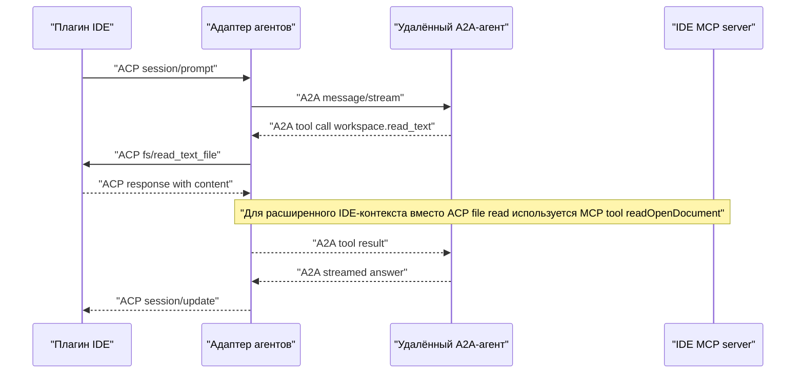
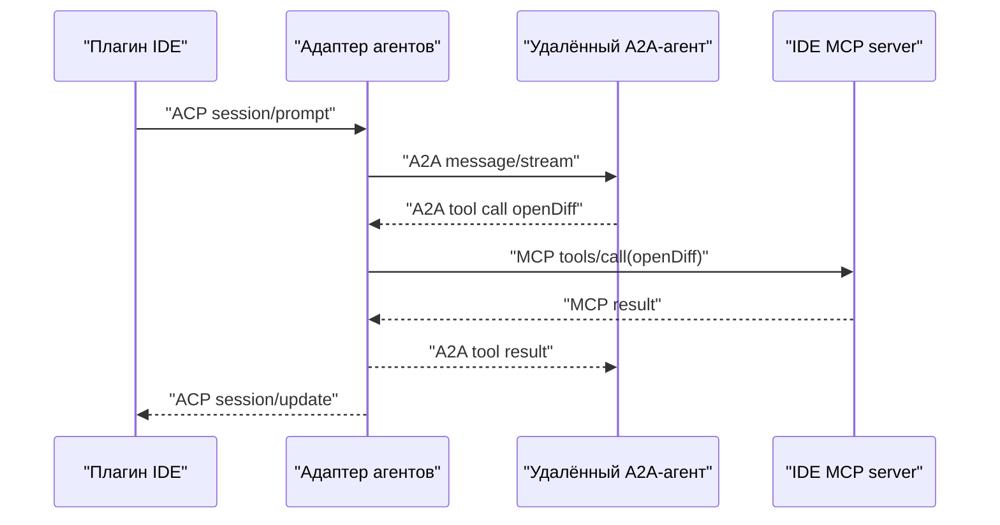
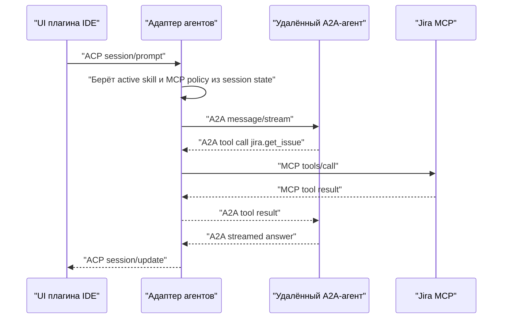
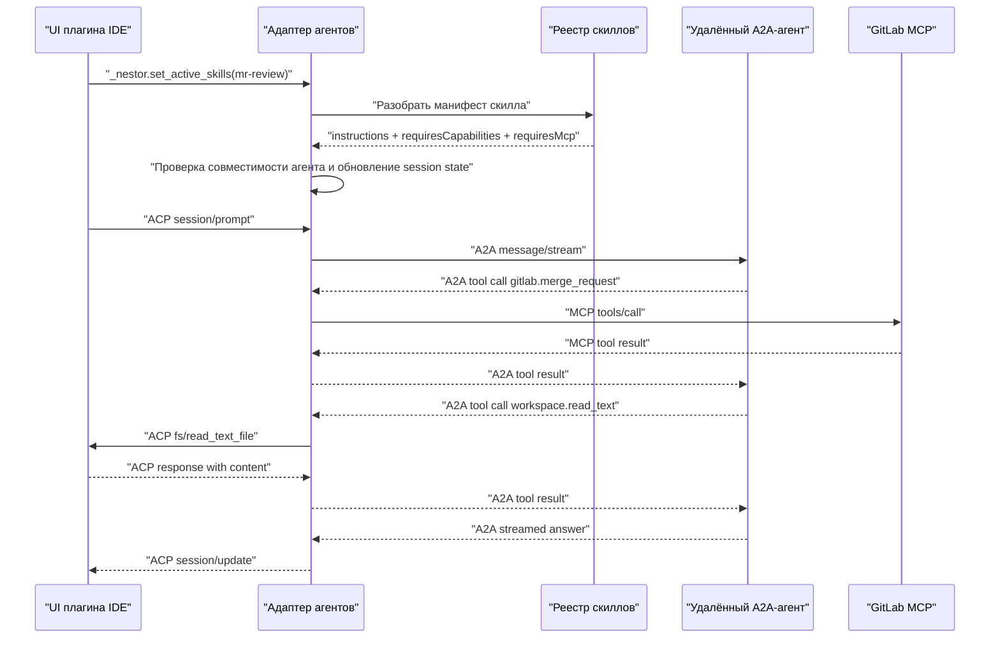

# nessy-acp-agent Realization RFC

|             |                                                       |
|-------------|-------------------------------------------------------|
| Jira epic   | [AIDT-5040](https://jira.tcsbank.ru/browse/AIDT-5040) |
| Author      | m.kapustin                                            |
| Created at  | 2026-04-09                                            |
| Description | RFC реализации nessy-acp-agent для плагинов           |

## Мотивация

Нужен отдельный локальный компонент, который:

1. Будет поставляться вместе с плагинами для JetBrains и VS Code.
2. Будет стандартизованно общаться с IDE.
3. Будет подключать A2A-агентов (ACP-агенты вне MVP).
4. Будет подключать MCP-серверы.

## Цель

Зафиксировать **дизайн и детали реализации nessy-acp-agent**:

1. Как адаптер общается с IDE.
2. Как адаптер общается с удалённым агентом.
3. Как адаптер маршрутизирует тулы, MCP и IDE capabilities.
4. Как адаптер конфигурируется и как пользователь добавляет агентов, MCP и скиллы.
5. На каком языке адаптер лучше реализовывать и почему.

## Требования

1. Адаптер должен работать и в JetBrains, и в VS Code с минимальным IDE-specific кодом вокруг него.
2. Протокол между IDE и адаптером должен быть ACP.
3. Протокол к удалённому агенту должен быть A2A.
4. Адаптер должен поддерживать внешних агентов, доступных по A2A.
5. Адаптер должен уметь вызывать MCP-тулы и активировать скиллы.
6. Адаптер должен иметь понятную и стабильную модель конфигурации для:
   - удалённых агентов;
   - MCP-серверов;
   - локальных скиллов.
7. Пользователь должен иметь возможность из UI видеть список доступных MCP-серверов и скиллов и включать их для текущей сессии.
8. Адаптер должен запускаться без предварительной установки Node.js, JRE или другого внешнего runtime.
9. Адаптер должен безопасно работать с локальными capabilities IDE:
   - read/write file;
   - terminal;
   - approvals;
   - дополнительные IDE-specific capabilities.
10. Адаптер должен обеспечивать удобный мониторинг и отладку: вести логи протокольного обмена, использовать сквозные идентификаторы запросов, отправлять телеметрию в статист.
11. Переход удалённого агента на A2A 2.0 не должен требовать пересборки всей логики nessy-acp-agent поверх протокола.

## Зоны ответственности

### Плагин IDE

Отвечает за:

1. Запуск и обновление nessy-acp-agent.
2. Собственный чатовый UI.
3. Реализацию ACP-клиента.
4. Выполнение ACP/MCP-запросов через API IDE.
5. Отрисовку прогресса, карточек тулов, подтверждений, планов, выбора агента, скиллов и активных MCP.

### Адаптер агентов

Отвечает за:

1. ACP-сервер для IDE.
2. Состояние сессий.
3. Маршрутизацию на выбранного агента.
4. Преобразование `ACP ↔ A2A`.
5. Управление жизненным циклом MCP-серверов.
6. Разбор манифестов скиллов и проверку их совместимости с активным агентом.
7. Применение политик и обработку подтверждений.
8. Логирование и телеметрию.
9. Хранение доступного и активного набора MCP-серверов и скиллов в рамках сессии.

### Удалённый A2A-агент

Отвечает за:

1. Планирование и исполнение сценариев на стороне бэкенда.
2. Вызов тулов бэкенда.
3. Вызов MCP на стороне бэкенда.
4. Генерацию стриминговых ответов и запросов на вызов тулов.

## Протоколы по границам

### Плагин IDE ↔ адаптер

Протокол: ACP поверх stdio.

Используем:

1. Стандартные ACP-методы для жизненного цикла сессии и capabilities клиента.
2. Собственные расширения `_nestor.*` для каталога агентов, скиллов и MCP-серверов.
3. Передачу адаптеру дескрипторов IDE MCP server, который плагин поднимает для расширенных IDE-инструментов.

Все расширения `_nestor.*` объявляются через capability negotiation в ACP `initialize`. Адаптер не вызывает, а плагин не обязан понимать расширения, не объявленные на handshake. Это позволяет независимо обновлять адаптер и плагин.

### Адаптер ↔ удалённый агент

Протокол: A2A.

Используем:

1. `message/stream`
2. жизненный цикл задач
3. `data parts` для вызовов тулов и результатов
4. расширения агента, если понадобятся дополнительные контракты capabilities

Во время перехода на A2A 2.0 версия wire-протокола на этой границе может меняться. Поэтому в адаптере зафиксированы два правила:

1. Бизнес-логика nessy-acp-agent не должна зависеть от конкретной версии A2A.
2. Весь version-specific код должен жить только внутри `a2a/` слоя.

Выбор версии A2A происходит так:

1. В дескрипторе агента в `agents.json` указывается поле `protocolVersion`.
2. При `initialize` адаптер выполняет A2A handshake и сверяет заявленную версию с фактической (через agent card или эквивалентный механизм discovery).
3. При несовпадении адаптер логирует предупреждение и использует версию, заявленную агентом, если она входит в список поддерживаемых реализаций.
4. Если версия не поддерживается, агент помечается как `incompatible` в `_nestor.list_agents` и не может быть выбран активным.

### Адаптер ↔ MCP-серверы

Протокол: MCP.

Используем:

1. `tools/list`
2. `tools/call`

Опционально, вне MVP или по мере необходимости:

1. `resources/list`
2. `resources/templates/list`
3. `resources/read`

## Внутренняя модель исполнения

Внутри nessy-acp-agent все вызовы приводятся к единой доменной модели:

1. `SessionCommand`
2. `SessionEvent`
3. `ToolInvocation`
4. `ToolResult`
5. `CapabilityRequest`
6. `CapabilityResult`
7. `AgentDescriptor`
8. `SkillManifest`
9. `DomainError`

Ключевой инвариант: ни один тип из `acp/*`, `a2a/*`, `mcp/*` не должен появляться в сигнатурах `session/*`, `registry/*`, `policy/*`. Детали конкретных протоколов не протекают в бизнес-логику маршрутизации и политик.

## Модель ответственности за тулы и возможности

### Возможности, которые предоставляет IDE через ACP

1. `fs/read_text_file`
2. `fs/write_text_file`
3. `terminal/*`
4. `session/request_permission`
5. Доступ к IDE MCP server, через который адаптер получает расширенные IDE-инструменты.

### Тулы, которыми управляет адаптер

1. MCP-инструменты, доступные через реестр nessy-acp-agent.
2. Активация скиллов.
3. Маршрутизация вызовов с учётом политик.

Правила изоляции:

1. Адаптер **никогда** не исполняет код MCP-тула внутри собственного процесса. MCP-сервер всегда либо отдельный дочерний процесс, либо удалённый endpoint.
2. Каноническая ответственность nessy-acp-agent — хранить дескрипторы, управлять жизненным циклом подключений, применять policy и маршрутизировать вызовы к нужному MCP-серверу.

### Тулы удалённого агента

1. Бизнес-тулы удалённого агента.
2. MCP на стороне агента.
3. Тулы оркестрации на стороне агента.

## IDE MCP server

Плагин IDE поднимает встроенный IDE MCP server с расширенными IDE-инструментами.

Минимальный набор IDE MCP tools:

1. `openDiff`
2. `closeDiff`
3. `openFile`
4. `readOpenDocument`
5. `getSelection`

Плагин передаёт адаптеру дескриптор этого сервера через ACP. Адаптер:

1. Добавляет IDE MCP server в свой MCP registry.
2. Вызывает расширенные IDE-инструменты уже по MCP, а не по ACP.
3. Может отдавать эти инструменты любому подключённому агенту.

## Namespacing тулов

Имена тулов в разных MCP-серверах могут совпадать. Правило nessy-acp-agent:

1. При регистрации MCP-сервера в реестре адаптер автоматически префиксует все его тулы идентификатором сервера: `<serverId>.<toolName>`.
2. В A2A-слое агент видит только префиксованные имена.
3. Если два сервера пытаются зарегистрироваться под одним `serverId`, второй получает ошибку и не стартует (fail fast).
4. Имена тулов внутри одного сервера считаются уникальными по контракту MCP.

## Отмена и таймауты

Любой turn должен быть отменяем по всей цепочке.

Распространение отмены:

1. Пользователь жмёт `Stop` в UI.
2. Плагин отправляет ACP cancel для текущего turn.
3. Адаптер получает cancel, переводит сессию в состояние `cancelling`.
4. Адаптер посылает A2A task cancel удалённому агенту.
5. Все активные MCP tool calls в рамках turn получают `AbortSignal`.
6. После подтверждения отмены всеми сторонами сессия возвращается в `idle`.

Таймауты настраиваются на трёх уровнях:

1. `toolCallTimeoutMs` — максимальное время ожидания одного MCP tool call, по умолчанию 60 секунд.
2. `turnTimeoutMs` — максимальное время одного turn от `session/prompt` до `stopReason`, по умолчанию 10 минут.
3. `sessionIdleTimeoutMs` — максимальное время бездействия сессии, по умолчанию 60 минут.

При истечении любого таймаута адаптер инициирует отмену по той же цепочке и возвращает доменную ошибку.

## Модель ошибок

Три протокола имеют три разных формата ошибок. Канонический формат внутри nessy-acp-agent — `DomainError`:

```text
DomainError {
  code: string,        // стабильный машинный код
  message: string,     // человекочитаемое сообщение
  source: enum,        // ide | nessy-acp-agent | agent | mcp
  retryable: boolean,
  cause?: DomainError
}
```

Правила маппинга:

1. MCP `isError: true` → `DomainError { source: mcp }`.
2. A2A task failure → `DomainError { source: agent }`.
3. ACP JSON-RPC error от IDE → `DomainError { source: ide }`.
4. Внутренняя ошибка nessy-acp-agent → `DomainError { source: nessy-acp-agent }`.

Распространение:

1. Ошибка MCP внутри tool call агента возвращается в A2A как `tool result` с флагом ошибки. Агент сам решает, как её интерпретировать.
2. Ошибка, которая ломает turn целиком, возвращается в ACP как `session/update` с финальным `stopReason: error` и полем `error: DomainError`.
3. Ошибки жизненного цикла (запуск сессии, подключение агента) возвращаются как JSON-RPC error на соответствующий ACP-метод.

## Жизненный цикл сессии

Сессия nessy-acp-agent эфемерна и живёт только внутри текущего процесса nessy-acp-agent. Персистентная история чата — ответственность IDE плагина или удалённого агента, но не nessy-acp-agent.

Поведение при разных событиях:

1. **Рестарт nessy-acp-agent** — все сессии теряются. Плагин обязан инициализировать сессию заново через `session/new` и повторно применить активного агента, активные скиллы и активные MCP.
2. **Рестарт IDE** — адаптер завершается как дочерний процесс плагина. После перезапуска IDE сценарий такой же, как при рестарте nessy-acp-agent.
3. **Потеря соединения с удалённым агентом** — сессия переходит в состояние `degraded`, адаптер пытается переподключиться с backoff. UI получает событие `session/update` с информацией о состоянии.
4. **Падение MCP-сервера** — затрагиваются только тулы этого сервера, сессия сохраняется. См. раздел «Жизненный цикл MCP-серверов».

## Мульти-сессия и мульти-окна IDE

На каждое окно IDE (JetBrains project, VS Code workspace) плагин запускает **собственный экземпляр nessy-acp-agent**. Причины:

1. Изоляция workspace-специфичной конфигурации `.nestor/`.
2. Отсутствие конфликтов за локальные MCP-серверы, слушающие фиксированные порты.
3. Простая модель завершения: закрыли окно — завершили адаптер.

Глобальная пользовательская конфигурация `~/.nestor/` читается каждым экземпляром независимо. Запись в глобальный конфиг защищается файловой блокировкой.

## Жизненный цикл MCP-серверов

Модель состояний MCP-сервера:

1. `disabled` — выключен в конфиге или не включён в сессии.
2. `starting` — процесс запускается или идёт handshake.
3. `connected` — готов принимать вызовы.
4. `failed` — последний запуск завершился ошибкой.
5. `disconnected` — был `connected`, но соединение потеряно.

Правила:

1. MCP-сервер стартует лениво при первом включении в сессию через `_nestor.set_active_mcp_servers`.
2. При падении сервера адаптер пытается перезапустить его с экспоненциальным backoff (1с, 2с, 4с, 8с, максимум 60с) и после 5 неуспешных попыток переводит в `failed`.
3. Состояние сервера отражается в `_nestor.list_mcp_servers` и обновляется в UI через `session/update`.
4. При выключении сервера в сессии адаптер посылает ему `shutdown` и завершает процесс.

## Permission model

Модель подтверждений:

1. Движок политик nessy-acp-agent принимает решение, нужен ли approve для операции.
2. Если approve нужен, адаптер отправляет `session/request_permission` в IDE.
3. IDE показывает диалог и возвращает результат.
4. Результат применяется с одной из трёх областей действия:
   - `once` — только этот конкретный вызов;
   - `session` — до конца текущей сессии;
   - `always` — записывается в `.nestor/policy.json` проекта или `~/.nestor/policy.json` пользователя.
5. Все решения логируются с timestamp, областью действия и контекстом вызова.

## Конфигурация: hot-reload

1. Адаптер следит за изменениями в `~/.nestor/` и `.nestor/` через file watcher.
2. Все изменения применяются с debounce 500 мс, чтобы не реагировать на промежуточные состояния во время сохранения.
3. При невалидном JSON адаптер сохраняет предыдущую версию конфигурации в памяти, логирует ошибку и показывает её в `_nestor.get_runtime_status`. Сессия продолжает работать на старом конфиге.
4. Запись конфигурации через UI (`Add Agent`, `Add MCP server`, `Add Skill`) и ручное редактирование файла используют один и тот же путь через файловую блокировку, чтобы избежать гонок.

## Сценарии использования

Ниже приведены **упрощённые примеры тел запросов и ответов**. Конкретные имена полей A2A могут отличаться от wire-формата реального протокола; здесь они показаны в упрощённом виде для иллюстрации потока данных.

### 1. Удалённый A2A-агент читает локальный файл через IDE



Здесь:

1. Пользовательский UI работает только с ACP.
2. Удалённый агент не знает деталей IDE.
3. Адаптер использует ACP для базовых IDE capabilities и MCP для расширенных IDE-инструментов.

Ниже показан полный минимальный цикл: пользовательский prompt, tool call, возврат результата tool call, текстовый ответ агента и обновление UI.

`ACP session/prompt` от IDE к адаптеру:

```json
{
  "jsonrpc": "2.0",
  "id": "acp-1",
  "method": "session/prompt",
  "params": {
    "sessionId": "s1",
    "prompt": [
      {
        "role": "user",
        "content": [
          {
            "type": "text",
            "text": "Прочитай src/app.ts и объясни, что делает main"
          }
        ]
      }
    ]
  }
}
```

`A2A message/stream` от nessy-acp-agent к удалённому агенту:

```json
{
  "jsonrpc": "2.0",
  "id": "a2a-1",
  "method": "message/stream",
  "params": {
    "message": {
      "role": "user",
      "parts": [
        {
          "kind": "text",
          "text": "Прочитай src/app.ts и объясни, что делает main"
        }
      ]
    }
  }
}
```

`A2A tool call` от удалённого агента к адаптеру:

```json
{
  "kind": "data",
  "data": {
    "id": "call-1",
    "function": {
      "name": "workspace.read_text",
      "arguments": {
        "path": "/repo/src/app.ts",
        "line": 1,
        "limit": 200
      }
    }
  }
}
```

`ACP fs/read_text_file` от nessy-acp-agent к IDE:

```json
{
  "jsonrpc": "2.0",
  "id": "acp-2",
  "method": "fs/read_text_file",
  "params": {
    "sessionId": "s1",
    "path": "/repo/src/app.ts",
    "line": 1,
    "limit": 200
  }
}
```

Ответ IDE:

```json
{
  "jsonrpc": "2.0",
  "id": "acp-2",
  "result": {
    "content": "export function main() { ... }"
  }
}
```

`A2A tool result` от nessy-acp-agent к агенту:

```json
{
  "kind": "data",
  "data": {
    "tool_call_id": "call-1",
    "content": "export function main() { ... }"
  }
}
```

`A2A streamed answer` от удалённого агента к адаптеру:

```json
{
  "kind": "status-update",
  "status": {
    "state": "working",
    "message": {
      "role": "agent",
      "parts": [
        {
          "kind": "text",
          "text": "Функция main инициализирует конфигурацию, затем запускает HTTP-сервер."
        }
      ]
    }
  }
}
```

`ACP session/update` от nessy-acp-agent к IDE:

```json
{
  "jsonrpc": "2.0",
  "method": "session/update",
  "params": {
    "sessionId": "s1",
    "update": {
      "type": "message_delta",
      "text": "Функция main инициализирует конфигурацию, затем запускает HTTP-сервер."
    }
  }
}
```

Финальное завершение turn:

```json
{
  "jsonrpc": "2.0",
  "id": "acp-1",
  "result": {
    "stopReason": "end_turn"
  }
}
```

### 1a. Агент открывает diff через IDE MCP

Это вариация сценария 1, показывающая только форму вызова IDE MCP tool. Полный пользовательский цикл повторяет сценарий 1 и опущен для краткости.



`MCP tools/call(openDiff)` от nessy-acp-agent к IDE MCP server:

```json
{
  "jsonrpc": "2.0",
  "id": "mcp-1",
  "method": "tools/call",
  "params": {
    "name": "openDiff",
    "arguments": {
      "path": "/repo/src/app.ts",
      "oldText": "const value = 1;",
      "newText": "const value = 2;"
    }
  }
}
```

Ответ IDE MCP server:

```json
{
  "jsonrpc": "2.0",
  "id": "mcp-1",
  "result": {
    "content": [
      {
        "type": "text",
        "text": "Diff opened"
      }
    ],
    "isError": false
  }
}
```

### 2. Целевой сценарий: удалённый агент вызывает Jira MCP через адаптер



`A2A tool call` от удалённого агента к адаптеру:

```json
{
  "kind": "data",
  "data": {
    "id": "call-17",
    "function": {
      "name": "jira.get_issue",
      "arguments": {
        "key": "AIDT-123"
      }
    }
  }
}
```

`MCP tools/call` от nessy-acp-agent к Jira MCP:

```json
{
  "jsonrpc": "2.0",
  "id": "mcp-17",
  "method": "tools/call",
  "params": {
    "name": "get_issue",
    "arguments": {
      "key": "AIDT-123"
    }
  }
}
```

Ответ Jira MCP:

```json
{
  "jsonrpc": "2.0",
  "id": "mcp-17",
  "result": {
    "content": [
      {
        "type": "text",
        "text": "{\"key\":\"AIDT-123\",\"summary\":\"Сломан agent mode\",\"status\":\"In Progress\"}"
      }
    ],
    "isError": false
  }
}
```

`A2A tool result` от nessy-acp-agent к удалённому агенту:

```json
{
  "kind": "data",
  "data": {
    "tool_call_id": "call-17",
    "content": "{\"key\":\"AIDT-123\",\"summary\":\"Сломан agent mode\",\"status\":\"In Progress\"}"
  }
}
```

`A2A streamed answer` от удалённого агента к адаптеру:

```json
{
  "kind": "status-update",
  "status": {
    "state": "working",
    "message": {
      "role": "agent",
      "parts": [
        {
          "kind": "text",
          "text": "Задача AIDT-123 сейчас в статусе In Progress. Основная проблема связана с agent mode."
        }
      ]
    }
  }
}
```

`ACP session/update` от nessy-acp-agent к IDE:

```json
{
  "jsonrpc": "2.0",
  "method": "session/update",
  "params": {
    "sessionId": "s1",
    "update": {
      "type": "message_delta",
      "text": "Задача AIDT-123 сейчас в статусе In Progress. Основная проблема связана с agent mode."
    }
  }
}
```

### 3. Скилл `MR Review` как готовый режим работы



Смысл скилла:

1. Пользователю не нужно каждый раз заново писать длинную инструкцию.
2. Адаптер получает готовый режим работы с понятными требованиями.
3. Один и тот же скилл одинаково применим в JetBrains и VS Code.
4. Через скилл удобно включать policy, allowlist тулов и нужный контекст сессии.

`skill.json`:

```json
{
  "id": "mr-review",
  "title": "MR Review",
  "requiresCapabilities": ["workspace.read"],
  "requiresMcp": ["gitlab"],
  "allowedAgents": ["backend-default"],
  "visibility": "workspace"
}
```

`SKILL.md`:

```md
# MR Review

1. Получи описание и контекст текущего Merge Request.
2. Сопоставь цель MR с изменениями в workspace.
3. Сначала отмечай факты из кода, потом выводы и риски.
4. Если данных из MR не хватает, запроси у пользователя уточнение.
```

`ACP _nestor.set_active_skills` от IDE к адаптеру:

```json
{
  "jsonrpc": "2.0",
  "id": "acp-10",
  "method": "_nestor.set_active_skills",
  "params": {
    "sessionId": "s1",
    "skillIds": ["mr-review"]
  }
}
```

Ответ nessy-acp-agent:

```json
{
  "jsonrpc": "2.0",
  "id": "acp-10",
  "result": {
    "acceptedSkillIds": ["mr-review"],
    "contextVersion": 3
  }
}
```

Дальнейшие `A2A message/stream`, tool calls и `session/update` повторяют форму из сценариев 1 и 2.

## Скиллы

### Где хранить

1. Пользовательские скиллы: `~/.nestor/skills/<skill-id>/`
2. Скиллы проекта: `.nestor/skills/<skill-id>/`

### Как пользователь добавляет локальный скилл

1. Открывает UI `Add Skill`.
2. Выбирает область действия: `global` или `workspace`.
3. Заполняет `id`, `title`, текст `SKILL.md` и дополнительные поля манифеста.
4. Плагин создаёт `SKILL.md` и `skill.json` в соответствующем каталоге.
5. Адаптер через file watcher обнаруживает изменения и показывает новый скилл в `_nestor.list_skills`.

### Пресеты скиллов

Skill preset — именованный набор скиллов, который пользователь может применить одной кнопкой (например, `Setup T-Bank skills`).

Правила:

1. Presets поставляются вместе с адаптером как встроенные ресурсы. Список доступных presets возвращается через `_nestor.get_runtime_status`.
2. Применение preset не удаляет пользовательские скиллы. Семантика операции — `merge`: одноимённые скиллы могут быть обновлены значениями из preset, остальные не затрагиваются.
3. Preset может требовать наличия bundled зависимости (например, локального бинарника или MCP-сервера, к которому обращаются скиллы). Адаптер проверяет её через health check перед применением.
4. Если зависимость не готова, `_nestor.apply_skill_preset` возвращает доменную ошибку с кодом `preset_dependency_not_ready` и не модифицирует реестр скиллов.
5. После применения адаптер перечитывает реестр скиллов и обновляет список доступных скиллов в UI.

### Активация скиллов и MCP в UI

Для текущей сессии пользователь работает не с сырыми конфигами, а со списком доступных сущностей в UI:

1. UI запрашивает у nessy-acp-agent список доступных скиллов и MCP-серверов.
2. UI показывает их отдельными списками с чекбоксами.
3. Пользователь отмечает, какие скиллы и MCP-серверы должны быть активны в текущей сессии.
4. UI отправляет в адаптер только итоговый набор активных элементов.
5. Адаптер сохраняет этот набор в session state и применяет его при маршрутизации тулов и сборке контекста.

Важно разделять три состояния:

1. `доступно` — сущность есть в реестре и совместима с активным агентом.
2. `активно` — сущность включена пользователем для текущей сессии.
3. `подключено` — MCP-сервер реально поднят и готов принимать вызовы (см. «Жизненный цикл MCP-серверов»).

Редактирование конфигурации и активация в UI не смешиваются:

1. `Add MCP server` и `Add Skill` меняют канонические конфиги на диске.
2. Чекбоксы в UI меняют только состояние текущей сессии.

## MCP

### Где должен жить MCP

1. Jira, Confluence, internal HTTP APIs по умолчанию поднимаются на стороне nessy-acp-agent или на стороне агента.
2. MCP, завязанные на конкретный проект или рабочую станцию, делаются локальными и подключаются к адаптеру.

Правила передачи конфигурации:

1. Полный конфиг MCP не отправляется удалённому агенту на каждый запрос.
2. Если MCP находится на стороне nessy-acp-agent, агент знает только имена доступных тулов и результаты их вызова.
3. Если MCP находится на стороне агента, адаптеру достаточно знать policy и дескриптор совместимости, а не детали подключения.

### Где хранить конфиг

1. Глобальная пользовательская конфигурация: `~/.nestor/mcp.json`
2. Конфигурация проекта: `.nestor/mcp.json`
3. Используется объектный формат `mcpServers`, где ключом является идентификатор сервера. Это упрощает merge по имени и переопределения.

Пример:

```json
{
  "mcpServers": {
    "jira": {
      "owner": "nessy-acp-agent",
      "transport": "http",
      "url": "http://127.0.0.1:3100/mcp",
      "enabled": true
    }
  }
}
```

Для MCP на стороне агента достаточно дескриптора:

```json
{
  "mcpServers": {
    "jira": {
      "owner": "backend",
      "enabled": true
    }
  }
}
```

### MCP presets

MCP preset — именованный набор MCP-серверов, который пользователь может применить одной кнопкой (например, `Setup T-Bank MCP tools`).

Правила:

1. Presets поставляются вместе с адаптером как встроенные ресурсы. Список доступных presets возвращается через `_nestor.get_runtime_status`.
2. Применение preset не удаляет пользовательские MCP-серверы. Семантика операции — `merge`: одноимённые серверы могут быть обновлены значениями из preset, остальные не затрагиваются.
3. Preset может требовать наличия bundled зависимости (например, локального бинарника). Адаптер проверяет её через health check перед применением.
4. Если зависимость не готова, `_nestor.apply_mcp_preset` возвращает доменную ошибку с кодом `preset_dependency_not_ready` и не модифицирует конфиг.
5. После применения адаптер перечитывает конфиг и запускает переподключение MCP.

### Как пользователь добавляет MCP

1. Открывает настройки агента в UI.
2. Выбирает `Add MCP server`.
3. Заполняет `id`, `owner`, `transport`, `endpoint` или `command`.
4. Плагин записывает каноническую конфигурацию в `.nestor/mcp.json` или `~/.nestor/mcp.json`.
5. Адаптер через file watcher обнаруживает изменения и перестраивает реестр MCP.

## Агенты

### Где хранить конфиг агентов

1. Глобальная пользовательская конфигурация: `~/.nestor/agents.json`
2. Конфигурация проекта: `.nestor/agents.json`

Пример:

```json
{
  "defaultAgent": "backend-default",
  "agents": [
    {
      "id": "backend-default",
      "title": "Backend Agent",
      "type": "a2a",
      "protocolVersion": "1.0",
      "endpoint": "https://example/api/v1/code-agent/a2a/",
      "auth": {
        "kind": "keychain",
        "key": "nestor.backend-default.token"
      },
      "enabled": true
    }
  ]
}
```

### Как пользователь добавляет удалённого агента

1. Открывает UI `Add Agent`.
2. Выбирает тип `Remote A2A agent`.
3. Заполняет `id`, `title`, `endpoint`, способ авторизации.
4. Плагин записывает дескриптор в `.nestor/agents.json` или `~/.nestor/agents.json`. Секреты сохраняются в OS keychain.
5. Адаптер перечитывает реестр, и агент появляется в `_nestor.list_agents`.

### Как пользователь переключает активного агента

```json
{
  "jsonrpc": "2.0",
  "id": "17",
  "method": "_nestor.set_active_agent",
  "params": {
    "sessionId": "s1",
    "agentId": "backend-default"
  }
}
```

## Расширения ACP

Минимальный обязательный набор расширений поверх ACP. Все методы объявляются через capability negotiation на `initialize`.

### `_nestor.list_agents`

Возвращает доступные дескрипторы агентов и их совместимость.

### `_nestor.set_active_agent`

Выбирает активного агента в текущей сессии.

### `_nestor.list_skills`

Возвращает доступные скиллы и их совместимость с текущим агентом.

### `_nestor.set_active_skills`

Устанавливает набор скиллов для текущей сессии.

### `_nestor.list_mcp_servers`

Возвращает доступные MCP-серверы, их совместимость с текущим агентом и текущее состояние подключения.

### `_nestor.set_active_mcp_servers`

Устанавливает набор MCP-серверов, активных для текущей сессии.

### `_nestor.get_runtime_status`

Возвращает статус nessy-acp-agent, активного агента, реестра MCP, состояния авторизации и готовности bundled зависимостей.

### `_nestor.list_ide_mcp_servers`

Возвращает дескрипторы MCP-серверов, которые плагин IDE предоставляет адаптеру для расширенных IDE-инструментов.

### `_nestor.apply_mcp_preset`

Применяет именованный MCP preset. Семантика и гарантии описаны в разделе «MCP presets».

### `_nestor.apply_skill_preset`

Применяет именованный skill preset. Семантика и гарантии описаны в разделе «Пресеты скиллов».

## Конфигурационные слои

Четыре уровня конфигурации:

1. Встроенные значения по умолчанию, поставляемые с адаптером.
2. Глобальная пользовательская конфигурация в `~/.nestor/`.
3. Конфигурация проекта в `.nestor/`.
4. Переопределения текущей сессии, выставленные через UI.

Типичные session overrides:

1. активный агент;
2. активные скиллы;
3. активные MCP-серверы;
4. временные policy overrides, если они разрешены продуктом.

Приоритет:

`session overrides > workspace config > global config > built-in defaults`

Это даёт:

1. Команде возможность версионировать проектные настройки.
2. Пользователю возможность добавить личные агенты и скиллы.
3. UI остаётся тонкой оболочкой над канонической конфигурацией.

## Безопасность

### Базовые правила

1. Никакой произвольный исполняемый код не загружается в процесс плагина IDE.
2. Локальные агенты и MCP запускаются как внешние процессы.
3. Все операции записи файлов, команды терминала и привилегированные действия проходят через движок политик nessy-acp-agent.
4. ACP-запросы на подтверждение и `fs`/`terminal` capability requests логируются.

### Подтверждения

1. Решение о необходимости approve принимает движок политик nessy-acp-agent.
2. Диалог рисует IDE-плагин.
3. Результат возвращается в адаптер по ACP с указанием области действия (`once`, `session`, `always`).

## Логи и наблюдаемость

Обязательно:

1. Структурированные логи в адаптере.
2. Сквозной идентификатор на всю цепочку `IDE session → nessy-acp-agent session → remote task/tool`.
3. Журнал сырых ACP-сообщений.
4. Журнал сырых A2A-сообщений.
5. Журнал сырых MCP-сообщений.

Минимальные сущности телеметрии:

1. `session_started`
2. `agent_selected`
3. `skill_activated`
4. `tool_requested`
5. `tool_completed`
6. `tool_rejected`
7. `mcp_call_started`
8. `mcp_call_completed`
9. `permission_requested`
10. `permission_resolved`
11. `turn_cancelled`
12. `timeout_hit`

## Выбор языка реализации

### Критерии

1. Самодостаточный артефакт для macOS, Windows, Linux.
2. Удобная поставка в JetBrains и VS Code.
3. Отсутствие внешнего runtime в стандартном пользовательском сценарии.
4. Удобная работа с stdio, JSON-RPC, HTTP, SSE.
5. Простота сопровождения долгоживущего локального процесса.
6. Достаточная скорость старта и малое потребление памяти.
7. Возможность переиспользовать текущие наработки команды.

### Варианты

| Язык       | Плюсы                                                                                                                                        | Минусы                                                                                               | Вывод                                             |
|------------|----------------------------------------------------------------------------------------------------------------------------------------------|------------------------------------------------------------------------------------------------------|---------------------------------------------------|
| TypeScript | Максимальное переиспользование кода и экспертизы из `nessy-cli` и VS Code, самый быстрый путь к ACP MVP, низкая стоимость протокольного слоя | Нужно отдельно решить упаковку и поставку runtime, выше потребление памяти, сложнее дистрибуция      | Рекомендуемый вариант для текущей реализации      |
| Go         | Один бинарник, хорошо подходит для долгоживущего локального процесса, сильная поддержка HTTP/SSE/JSON-RPC, уже используется на backend A2A   | Нет готового ACP SDK, ACP layer нужно реализовывать самостоятельно, меньше прямого переиспользования | Хороший долгосрочный вариант, но дороже на старте |
| Kotlin/JVM | Хорошо ложится в экосистему JetBrains                                                                                                        | Плохо для VS Code, нужен JVM runtime или тяжёлая упаковка                                            | Не рекомендован как единый кросс-IDE runtime      |
| Rust       | Отличный self-contained binary, высокая производительность                                                                                   | Высокая цена разработки, слабое переиспользование существующих наработок                             | Возможен, но не оптимален для текущей команды     |

### Рекомендация

Рекомендуется реализовывать адаптер на **TypeScript**.

Причины:

1. Самый быстрый путь к рабочему MCP/ACP/A2A MVP.
2. Переиспользование существующих наработок из `nessy-cli` и плагина VS Code.
3. Для ACP это самый низкорисковый вариант: не требуется писать протокольный слой с нуля на языке без SDK.
4. У команды уже есть релевантный код и экспертиза в TypeScript вокруг интеграций агентного рантайма.

Главный недостаток: нужно отдельно решить поставку runtime так, чтобы пользователь не устанавливал системный Node.

Чтобы сохранить требование про happy path без внешнего runtime, предлагается один из двух путей:

1. Поставлять адаптер как JS bundle вместе с приватным bundled Node, которым управляет сам плагин.
2. Собирать standalone executable поверх TypeScript-кода, если выбранный toolchain окажется достаточно стабильным.

На уровне RFC фиксируется только требование:

1. Пользователь не должен вручную устанавливать Node.
2. Конкретный механизм упаковки выбирается отдельно на этапе реализации spike.

## Этапы внедрения

### Этап 1. MVP

1. Адаптер, поставляемый вместе с плагином, запускается из JB и VS Code.
2. Интерфейс с IDE работает по ACP с capability negotiation на `initialize`.
3. Поддерживается только удалённый A2A-агент.
4. Поддерживаются:
   - `session/prompt`
   - `session/update`
   - `session/request_permission`
   - `fs/read_text_file`
   - `fs/write_text_file`
   - `terminal/*`
5. Добавляются `_nestor.list_agents` и `_nestor.set_active_agent`.
6. Реализуются отмена turn, таймауты и модель ошибок.
7. A2A-слой сразу проектируется как versioned adapter с учётом перехода на A2A 2.0.

### Этап 2. MCP и скиллы

1. Добавляется реестр MCP на стороне nessy-acp-agent с моделью жизненного цикла.
2. Добавляется каноническая конфигурация `.nestor/mcp.json`.
3. Добавляется реестр скиллов из `.nestor/skills/`.
4. Добавляется workspace trust prompt.
5. Добавляются `_nestor.list_skills`, `_nestor.set_active_skills`.
6. Добавляются `_nestor.list_mcp_servers`, `_nestor.set_active_mcp_servers`.
7. Добавляется `_nestor.apply_mcp_preset` для сценариев вроде `Setup T-Bank MCP tools`.
8. Добавляется `_nestor.apply_skill_preset` для сценариев вроде `Setup T-Bank review skills`.

### Этап 3. Расширение IDE-контекста

1. Плагин поднимает IDE MCP server с tools `readOpenDocument`, `getSelection`, `openDiff`, `closeDiff`.
2. Добавляется ACP-расширение `_nestor.list_ide_mcp_servers`.
3. Подтягивается более богатый IDE-контекст через MCP.
4. Уточняется модель политик для сценариев edit/review.

### Этап 4. Поддержка ACP-агентов

1. Адаптер получает отдельный `ACP adapter` для подключения внешних ACP-агентов.
2. В конфигурации агентов появляется тип `acp` наряду с `a2a`.
3. Адаптер учится запускать ACP-агента как локальный процесс или подключаться к нему по поддерживаемому ACP transport.
4. Для ACP-агентов адаптер прокидывает базовые ACP capabilities:
   - `session/request_permission`
   - `fs/*`
   - `terminal/*`
5. Расширенные IDE-инструменты по-прежнему отдаются через IDE MCP server, а не через product-specific ACP methods.
6. UI продолжает работать с единым каталогом агентов и не должен различать A2A- и ACP-агентов на уровне session flow.

## Недостатки

1. ACP в чистом виде не покрывает каталог агентов и скиллов, поэтому расширения неизбежны.
2. Появляется отдельный локальный рантайм, который нужно поддерживать и обновлять.
3. Нужно проектировать и сопровождать сразу три класса интеграций: ACP, A2A, MCP.
4. Для TypeScript-продукта нужно отдельно поддерживать упаковку и кроссплатформенную поставку runtime.
5. Bundled Node добавляет обязательство по безопасности и регулярным hotfix-релизам.
6. Нужно отдельно продумать путь миграции для существующих agent mode сценариев.
7. Во время перехода на A2A 2.0 некоторое время придётся сопровождать несколько совместимых реализаций A2A-слоя.
